# HanLearn - Smart Mandarin Learning App


## a) Group Members & Work Distribution
| Name | Matric Number | Responsibilities
| :--- | :--- | :---|
| Nurul Nadhirah Binti Zakaria (@Nemylie) | 2213698 | Translation Page, Quiz Page, Progress Tracking Page, Report |
| Azwa Nurnisya Binti Ayub (@azwanurnisya) | 2217418 | Vocabulary Bank Page, Database, Report |
| Nur Ain Binti Mohamad Hisham (@nurainhisham) | 2216894 | Authentication, Settings Page, Dark Mode, Report |

## b) Project Title
**HanLearn - Smart Mandarin Learning App**

## c) Introduction
*   **Problem & Motivation:** Learning Mandarin Chinese is notoriously challenging for beginners due to its logographic writing system (Hanzi) and tonal pronunciation. Many existing learning resources are either too academic or lack engagement. There is a need for a streamlined, mobile-first solution that makes acquiring basic vocabulary and testing knowledge accessible and less intimidating.  

*   **Relevance:** As Mandarin becomes increasingly important in global business and culture, a tool that helps users bridge the language gap through daily practice, translation, and gamified quizzes is highly relevant for students, travelers, and lifelong learners. HanLearn is developed as a cross-platform mobile application using Flutter, supporting both Android and iOS devices which is feasible for all type of users.

## d) Objectives
1. To enable beginners to learn essential Mandarin vocabulary through structured and categorized lessons.
2. To assist users in understanding Mandarin in real-life situations using accurate English–Chinese translation tools.
3.  To implement an interactive quiz system that reinforces learning through active recall and immediate feedback.
4.  To create a personalized learning experience by tracking user progress, scores, and proficiency levels.

## e) Target Users
*   **Beginner Learners:** Individuals aged 7–35 with no prior Mandarin background who prefer mobile-based, self-paced learning with simple explanations.
*   **Students:** School or university students learning Mandarin who need a supplementary tool for revision, quizzes, and vocabulary reinforcement.
*   **Travelers:** Tourists and casual learners who needs quick references and translation assistance for daily interactions (food, travel, directions).

## f) Features and Functionalities
1.  **User Authentication Module:**
    *   Secure Sign Up and Login using Firebase Authentication (Email/Password).
    *   "Remember Me" functionality for convenient access.
    *   Profile management (Display Name, Level).

2.  **Vocabulary Bank:**
    *   Categorized word lists (e.g., Daily Conversation, Education, Travel, Food).
    *   Rich display including Chinese Character (Hanzi), Pinyin, and English Meaning.
    *   Audio pronunciation support (planned).

3.  **Translation Module:**
    *   Bidirectional translation (English ↔ Mandarin).
    *   Displays result in Hanzi and Pinyin.
    *   Ability to save translations to "My Vocabulary".

4.  **Quiz & Practice Module:**
    *   Gamified testing with various question types (Multiple Choice, Meaning Match).
    *   Real-time scoring and feedback (Correct/Incorrect indicators).
    *   Result summaries to track performance per session.

5.  **Learning Progress Tracker:**
    *   Visual dashboard showing Total Score, Words Learned count, and current User Level.
    *   Persistent progress tracking using Cloud Firestore.

## g) Proposed UI Mock-up
The application features a modern, clean interface adhering to **Material Design 3** principles, utilizing a **Maroon (Primary) and White (Surface)** color scheme for a professional yet inviting aesthetic.

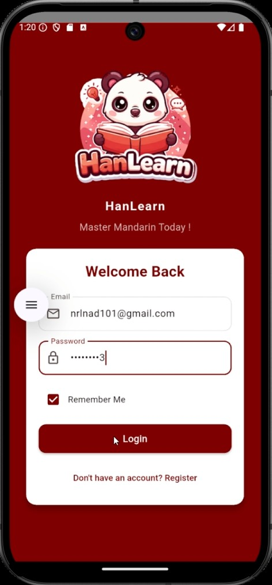

*   **Login Screen:** Minimalist design with a branded logo, input fields with icon prefixes, and a "Remember Me" checkbox.

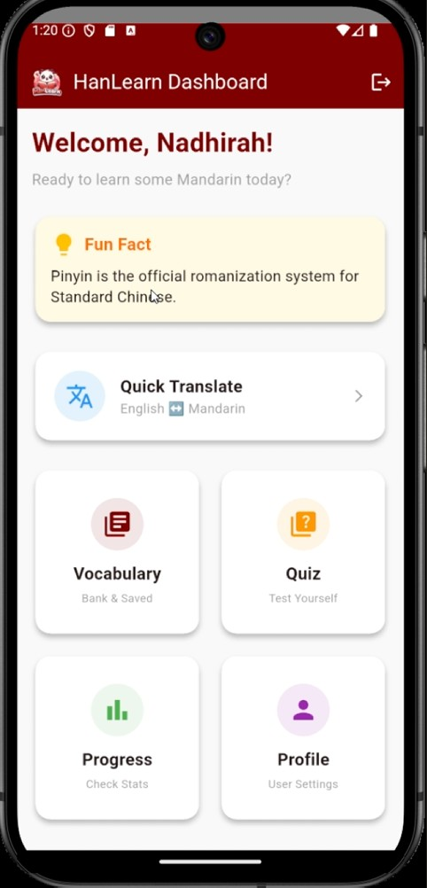

*   **Home Dashboard:** A central hub featuring a "Welcome" header, a "Fun Fact" card, and a grid layout for quick navigation to Learn, Quiz, Translate, and Profile sections.

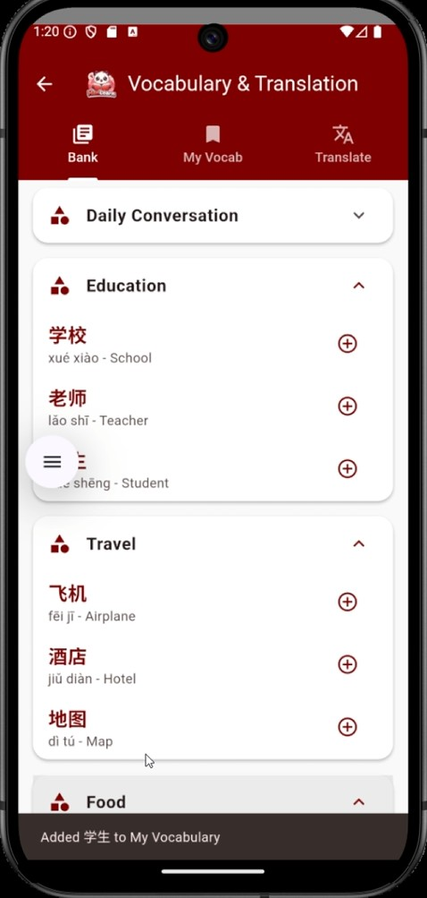

*   **Vocabulary List:** Clean card-based layout for each word, emphasizing readability of characters.

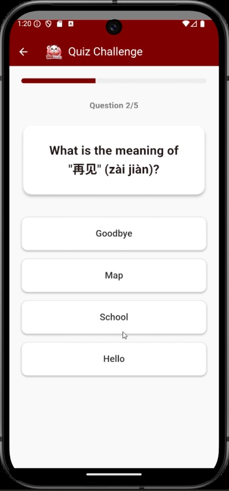

*   **Quiz Interface:** Focused view with the question at the top, large interactive answer buttons, and a progress bar.

## i) Data Model
The app uses a NoSQL document-based model in **Cloud Firestore**.

**Collection: `users`**
```json
{
  "uid": "string (PK)",
  "email": "string",
  "displayName": "string",
  "level": "number",
  "totalScore": "number",
  "wordsLearned": "number",
  "createdAt": "timestamp"
}
```

**Collection: `vocabulary`** (Global Content)
```json
{
  "id": "string (PK)",
  "character": "string",
  "pinyin": "string",
  "meaning": "string",
  "category": "string"
}
```

## h) Flowchart / User Flow
1.  **Launch:** App opens. Checks `shared_preferences` for "Remember Me" or existing session.

2.  **Authentication:**
    *   If not logged in: User lands on **Login Screen** -> Enter credentials -> Validated by Firebase.
    *   If new user: **Register Screen** -> Create Account -> Profile created in Firestore.
3.  **Main Interaction (Home):** User arrives at **Dashboard**.
    *   *Path A (Learn):* Select Category -> View List -> Tap word for details.
    *   *Path B (Quiz):* Start Quiz -> Answer Q1...Q10 -> View Score -> Update Firestore Progress.
    *   *Path C (Translate):* Enter text -> View translation.
4.  **Termination:** User logs out -> Session cleared -> Return to Login.


> This flowchart shows the user signup and login process


> This flowchart shows user actions for each feature after login

## i) Final UI Screenshots

### 1. Authentication
**Login Screen:** Secure entry point with email/password and Google Sign-In options.
| Light Mode | Dark Mode |
| :---: | :---: |
| 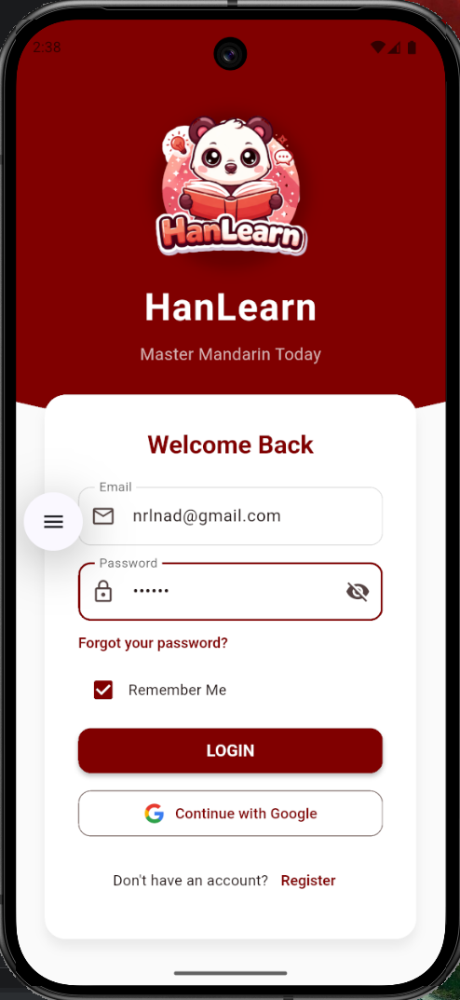 |  |

**Register Screen:** Simple account creation form with validation.
| Light Mode | Dark Mode |
| :---: | :---: |
| 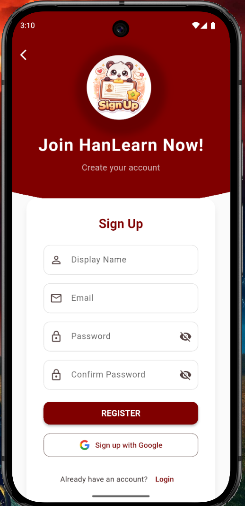 | 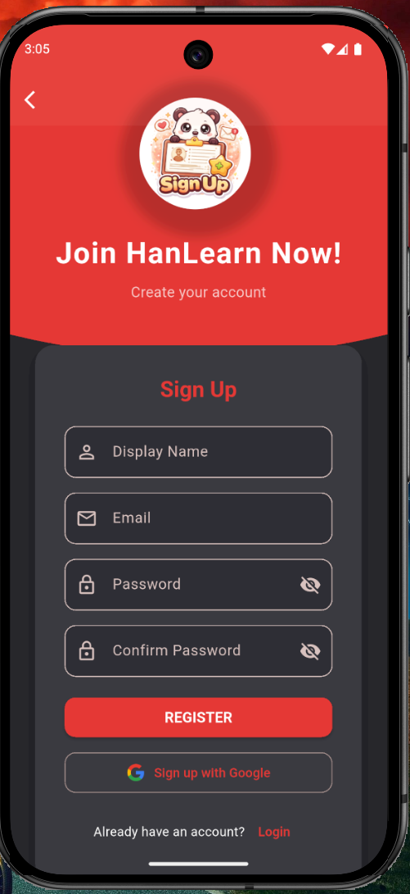 |

### 2. Main Dashboard
**Home Screen:** Central hub showing user progress, fun facts, and navigation to key modules.
| Light Mode | Dark Mode |
| :---: | :---: |
| 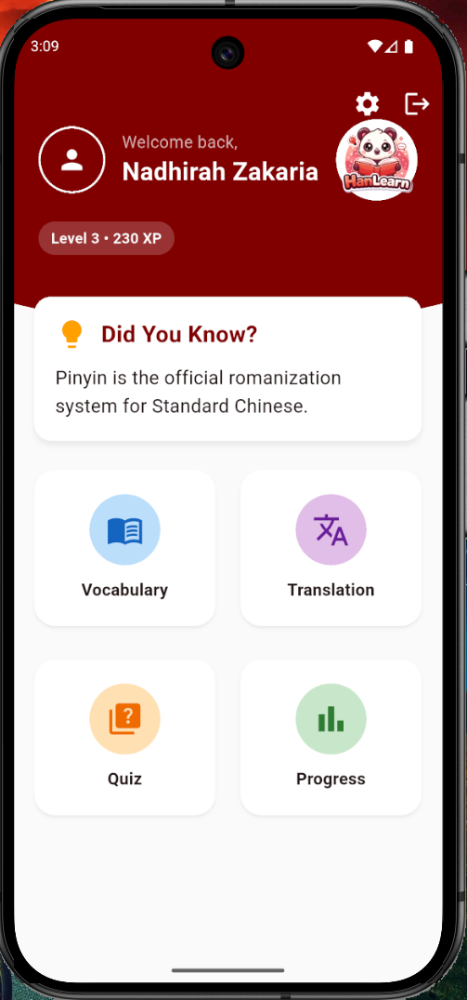 | 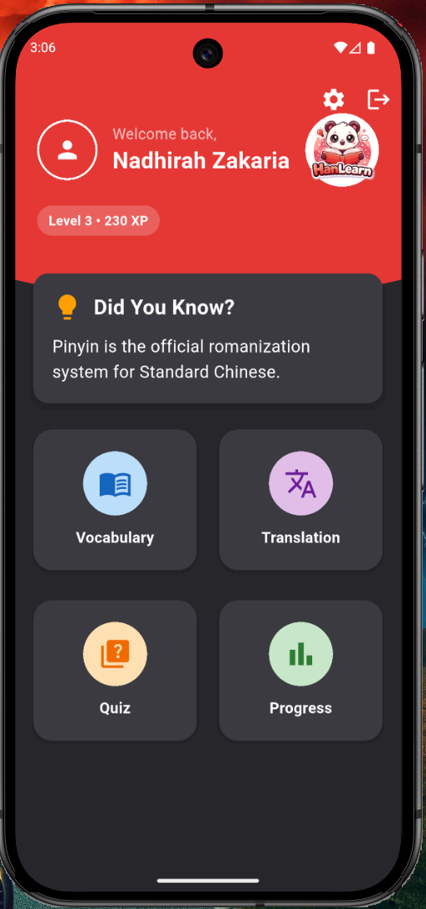 |

### 3. Learning Modules
**Vocabulary Bank:** Categorized word lists with expandable details (Hanzi, Pinyin, Meaning).
| Light Mode | Dark Mode |
| :---: | :---: |
| 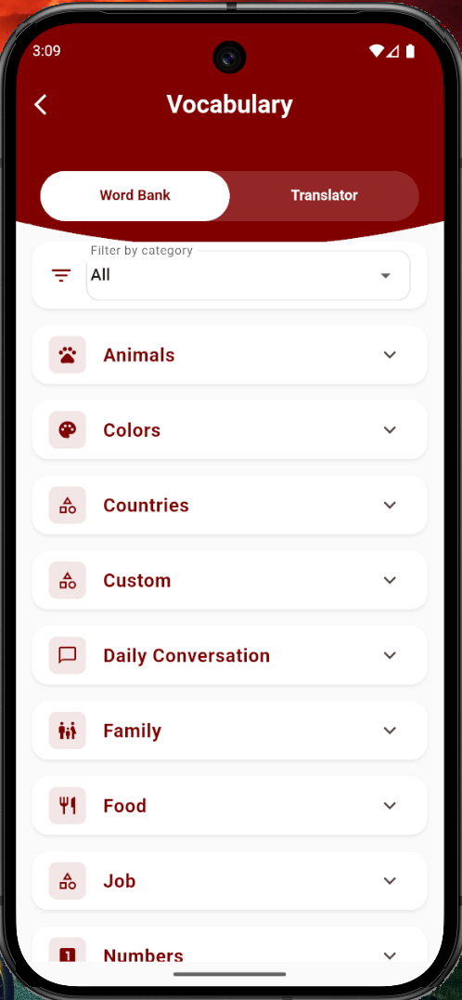 | 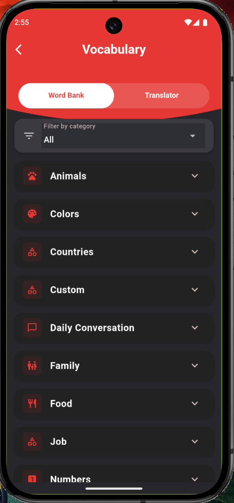 |

**Translation:** Bidirectional translation tool with example sentences.
| Light Mode | Dark Mode |
| :---: | :---: |
| 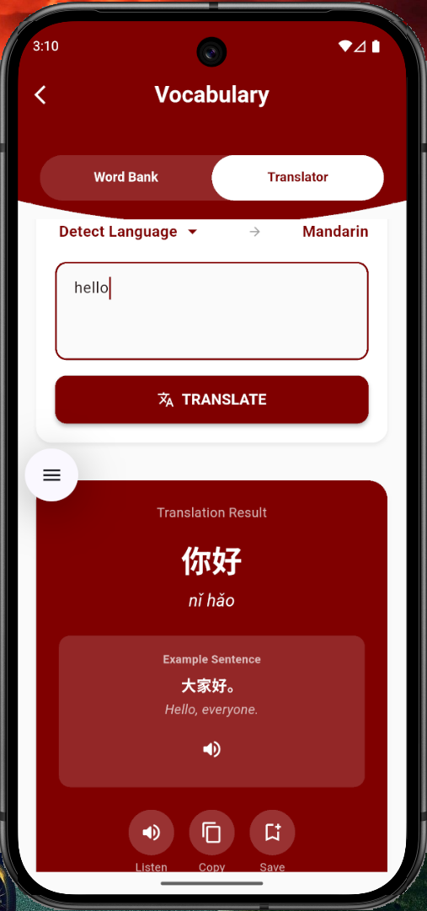 | 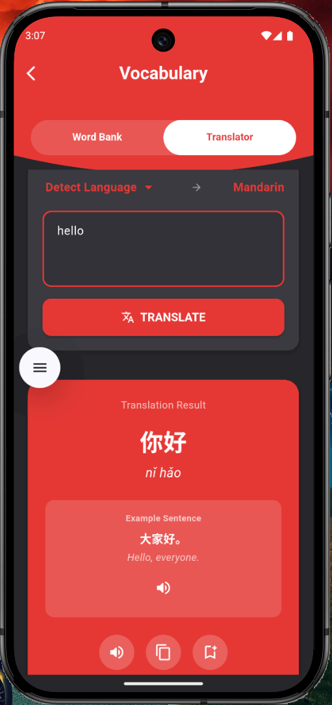 |

### 4. Assessment & Tracking
**Quiz Interface:** Interactive questions to test vocabulary retention.
| Light Mode | Dark Mode |
| :---: | :---: |
| 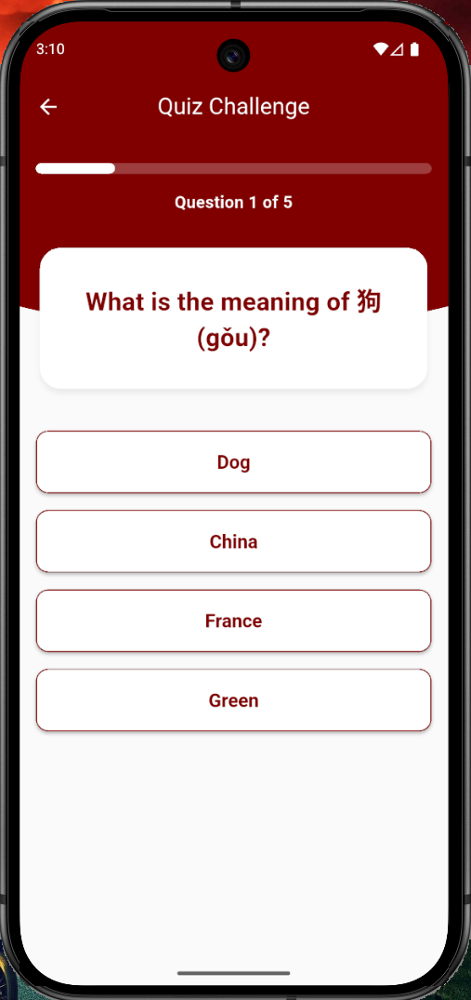 | 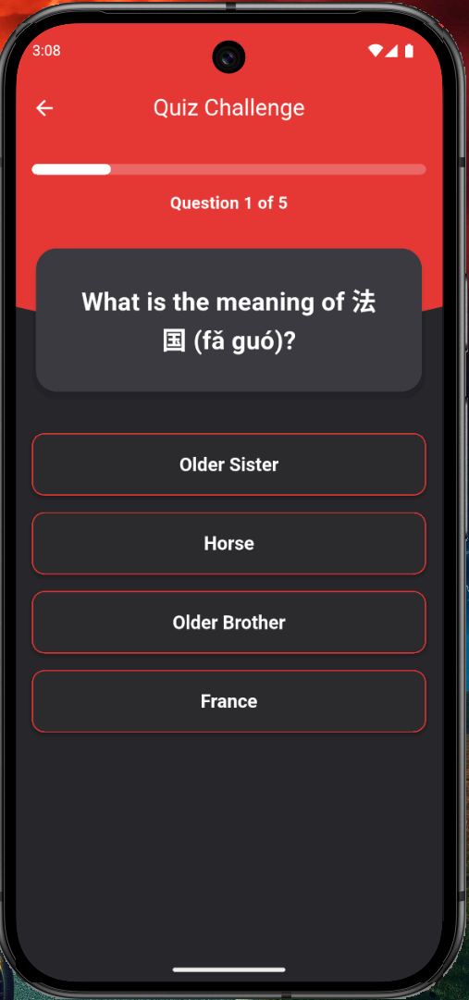 |

**Progress Tracker:** Visual stats showing level, XP, and learning milestones.
| Light Mode | Dark Mode |
| :---: | :---: |
| 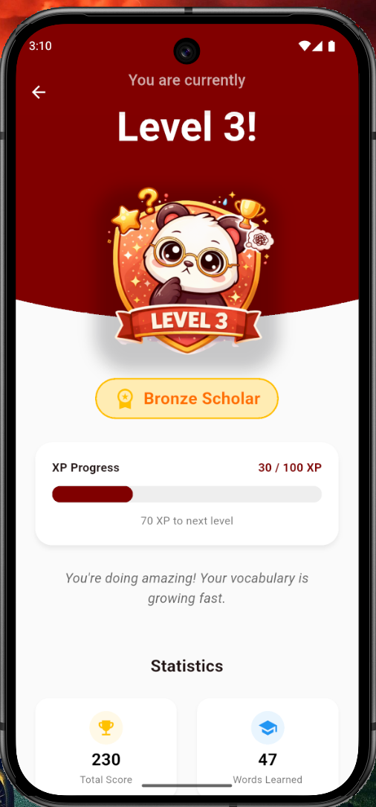 | 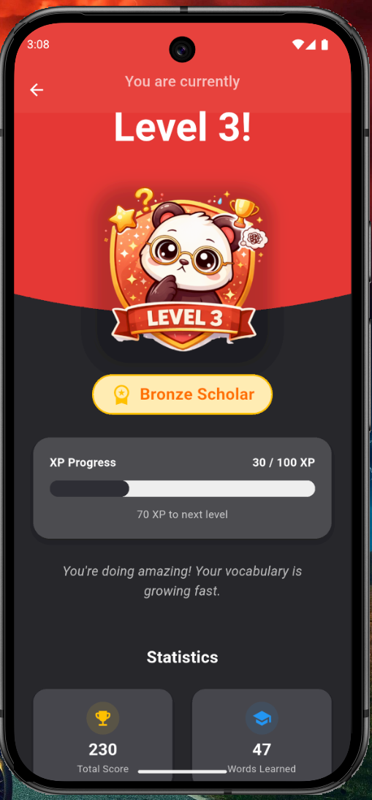 |

### 5. Settings
**Settings Page:** Customization options for theme (Dark/Light), account management, and app info.
| Light Mode | Dark Mode |
| :---: | :---: |
| 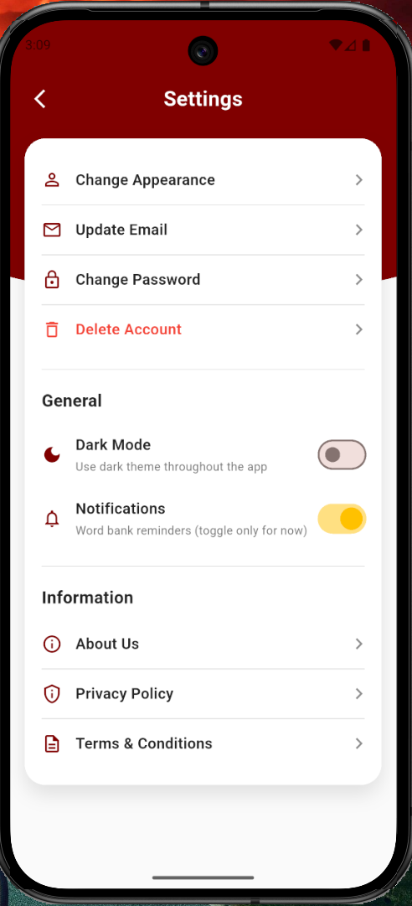 | 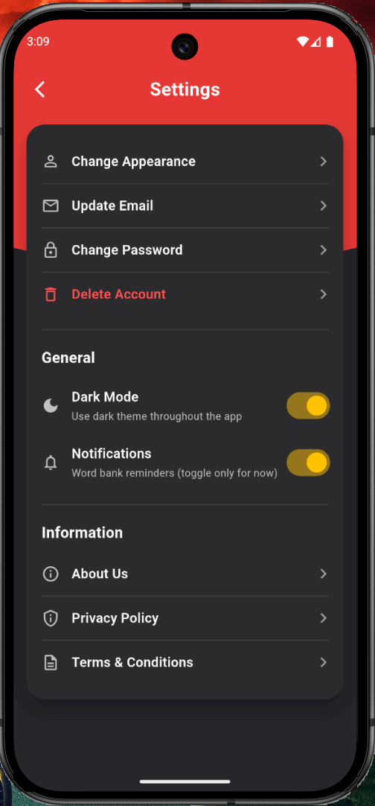 |

## j) Summary of Achieved Features

### 1. Authentication
The user authentication system ensures a seamless and secure login experience. Users can register and log in to create and manage their accounts. If they forget their credentials, they can easily recover their account using the Forgot Password option. For added convenience, users can sign in using their Google account with Gmail login/signup, streamlining the process across platforms. This ensures quick access while maintaining robust security standards.

### 2. Vocabulary
The Vocabulary feature enhances the user’s learning experience by offering an intuitive word bank interface. Users can explore the word list, which is organized by categories, enabling easier navigation. Each word entry displays the Chinese character, Pinyin, and meaning, alongside an optional voiceover for accurate pronunciation.

- TTS Integration: For pronunciation, the app utilizes the default Text-to-Speech (TTS) engine:
-- Android: Google’s native TTS engine
-- iOS: Apple's AVSpeechSynthesizer

Users can add custom words via the Translation module, instantly enriching the word bank with personalized entries. This functionality is seamlessly integrated with Firebase, ensuring that data is consistently synchronized across devices.

### 3. Translation
The Translation feature allows users to engage in bidirectional translation between Detected Languange and Mandarin. The app displays both the HanZi (Chinese characters) and Pinyin, making it easier for users to grasp both the written and phonetic forms of the language. Translations also include example sentences to provide context, helping users understand how words are used in real-life situations.Next, the app integrates with Pinyinl API to ensure precise Pinyin generation, while also offering voiceover functionality for correct pronunciation. Users can save translations to their "My Vocabulary" list for quick future reference, and they have copy options to enhance usability.

### 4. Quiz
The Quiz feature introduces an engaging and interactive learning environment for users. It consists of multiple-choice questions (MCQs) with 5 questions per challenge. Each question is worth 10 points, and a perfect score of 50 points is achievable, providing clear benchmarks for progress. Correct answers are highlighted in green, while incorrect ones are marked in red, helping users easily track their performance. After completing the quiz, users can review their score and correct answers. They can also choose to retake the quiz or return to the home screen. The quiz results are automatically updated to the user's progress stats, providing immediate feedback and motivation.

### 5. Progress
The Progress feature allows users to track their learning journey. It displays the user's current level based on their accumulated knowledge. As users progress, their level increases, providing a tangible sense of achievement. Statistics such as total score, words learned, and level progress are shown to motivate continuous learning. Users can also view their next progress goal, which sets a clear target for further improvement, encouraging consistent engagement with the app.

### 6. Settings
The Settings feature provides users with full control over their app experience. It includes the following options:
- Appearance customization (e.g., theme settings)
- Account management: update email, change password, and even delete account if needed
- Dark mode for an enhanced user experience in low-light conditions
- Notifications to keep users informed of app activities
- Access to app information, including About Us, Privacy Policy, and Terms & Conditions, ensuring full transparency and compliance.

## k) Technical Explanation

### Technology Stack
**1. Framework:** Flutter (Dart) for cross-platform mobile app development.
**2. Firebase Integration:**
     - Firebase Authentication: Supports both email/password and google oauth..
     - Cloud Firestore: NoSQL database for storing user profiles and learning data.
     - Firestore Rules: Configured to ensure access only for authenticated users.
**3. State Management:**
The Provider package is used to manage and propagate state changes efficiently across the app.

a. Stateless vs Stateful Widgets:
- Stateless widgets are used for parts of the UI that do not change after the initial build, like static content (e.g., icons, labels).
- Stateful widgets are used when the UI needs to be updated dynamically, such as when displaying live data, updating scores, or managing user authentication states.

b. In the app, VocabularyProvider is a ChangeNotifier that manages the vocabulary data, including fetching, adding, and deleting words in Firestore. This provider is wrapped around the app’s widget tree, allowing state changes (e.g., adding a word) to trigger UI updates.

c. pubspec.yaml is where we define the dependencies for the packages used, such as provider, firebase_core, cloud_firestore, and external packages like translator, Pinyinl, and shared_preferences. These dependencies are essential for the app’s functionality.

**4. External Packages:**
     - `translator`: For API-based translatioin services.
     - `Pinyinl`: For converting Hanzi characters to Pinyin.
     - `shared_preferences`: For local storage of user settings (Remember me).
**5. Authentication:** Firebase auth with platform-specific providers (email/password, google oauth).

**6. Architecture/Design**
The HanLearn app follows the MVVM (Model-View-ViewModel) architecture to separate concerns and ensure that the code is modular, maintainable, and scalable. Here's an overview of the app's structure:

- Model: Represents the data used in the app. It includes entities like WordModel (for vocabulary items) and user authentication details. These models are directly tied to data from Firestore.

- View: This is the UI layer where the app’s visual components (screens and widgets) are defined. Each screen, like the vocabulary list or translation page, is implemented as a StatelessWidget or StatefulWidget, depending on whether the data is dynamic or static.

- ViewModel: This layer interacts with Firebase, handles business logic, and updates the UI. Providers such as VocabularyProvider are responsible for managing state changes and business logic, like fetching vocab data or updating quiz results. The ViewModel handles data fetching, manipulation, and syncing with Firebase.

In terms of UI design, the app uses a Material Design approach to ensure a consistent and user-friendly experience across both iOS and Android platforms. It also features a dark mode for user customization.

**7. Key Technical Decisions**
a. Flutter for Cross-Platform Development: Flutter was chosen because it allows us to build both iOS and Android apps using a single codebase, saving time and effort.

b. Provider for State Management: We use Provider to manage app data, like user login status, quiz progress, and vocabulary. This helps keep the app’s UI in sync with the underlying data.

c. Firebase as Backend: Firebase is used for both authentication and storing data. It’s easy to set up, scales well as the app grows, and lets us focus on development without worrying about servers.

d. Firestore for Database: We use Firestore, a NoSQL database, to store vocabulary and user data. It’s flexible and allows us to store data in a way that can easily grow and change.

e. External Packages:
- translator API is used for translating text to Mandarin.
- shared_preferences saves user preferences like login credentials and theme settings on the device.

f. Firebase Authentication: Firebase handles user sign-in and account management, making it easy for users to register, log in, and securely manage their accounts.

## l) Limitations & Future Enhancements

### Limitations
**1) Forgot Password**
   - Firebase email reset link requires access to the email inbox.
   - Email/password accounts: works for real emails that can receive the reset link.
   - Google sign-in accounts: password management is handled by Google, so reset is not supported within the app.
   - Dummary emails: reset link can be sent, but the link can't be accessed for the fake email
  
**2) Update Email:**
   - Changes user email in firebase auth and firestore profile.
   - Firebase requires reauthentication for email changes.
   - Email/password accounts: supported for real and dummy emails (no email verification needed).
   - Google sign-in accounts: not supported, as Google manages email, so changing it can cause inconsitent login behaviour

**3) Firestore Storage:**
   - The firestore spark plan (free) restricts the ability to upload media files.
  
### Future Enhancements
**1) Forgot Password:**
   - Allow resetting password for Google sign-in accounts using firebase authentication, if Google provides such feature.
   - Use alternative method for dummy emails users to confirm their identity (for example: using phone number or other form of user verification to ensure the user is legit before allowing them to change their email or password.

**2) Update Email:**
   - Support email update for Google sign-in accounts without causing login issues, possibly by managing firebase account linking directly.
   - Implement email verification for dummy email users when updating their email addresses.

**3) Firestore Storage:**
   - Consider upgrading to a paid firestore plan to unlock more storage capacity for uploading media files.


## m) References
*   **Flutter Documentation:** [https://flutter.dev/docs](https://flutter.dev/docs)
*   **Firebase Documentation:** [https://firebase.google.com/docs](https://firebase.google.com/docs)
*   **Provider Package:** [https://pub.dev/packages/provider](https://pub.dev/packages/provider)
*   **Material Design Guidelines:** [https://m3.material.io/](https://m3.material.io/)
